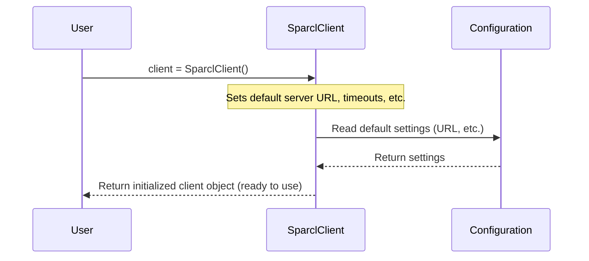

# Chapter 1: SPARCL Client (`SparclClient`)

Welcome to the SPARCL tutorial! SPARCL (SPectra Analysis and Retrievable Catalog Lab) is a fantastic resource provided by NOIRLab that holds millions of astronomical spectra (think of them as detailed light fingerprints from stars, galaxies, etc.). This tutorial will guide you on how to access and use this data using a Python tool called `sparclclient`.

Imagine SPARCL is a giant, online library full of spectral "books." How do you talk to this library over the internet to find and borrow the books you need? That's where the `SparclClient` comes in!

## What is the `SparclClient`?

The `SparclClient` is the main tool in the `sparclclient` Python package. It's like the remote control for the SPARCL service. You need this client to connect to the SPARCL database at NOIRLab and tell it what you want to do – like searching for specific spectra or downloading them.

Think of it as your personal librarian for the SPARCL digital library. This librarian knows exactly how to communicate with the main library (the SPARCL server), handle the connection details, and even manage login credentials if needed for special collections (though most data is public!).

**Our Goal:** In this chapter, we'll learn the very first step: how to create your own `SparclClient` object (your librarian) in Python.

## Creating Your Librarian: The `SparclClient` Instance

To start interacting with SPARCL, you first need to create an instance of the `SparclClient`. This is like hiring your librarian.

First, you need to import the `SparclClient` class from the `sparcl.client` module.

```python
# SPARCL imports
from sparcl.client import SparclClient

# Other imports used in the original notebook (not strictly needed for this step)
# import numpy as np
# ... and others
```

This line tells Python: "I want to use the `SparclClient` tool found inside the `sparcl.client` part of the library."

Now, creating the client is super simple:

```python
client = SparclClient()
client # Displaying the client shows some basic info about it
```

Running this code does the following:
1.  `client = SparclClient()`: This calls the `SparclClient` "blueprint" to create a new object, which we name `client`. This object is now ready to communicate with the SPARCL server.
2.  `client`: In interactive environments like Jupyter notebooks, typing the variable name like this often shows a helpful summary of the object.

The output you might see looks something like this (versions and details might vary):

```text
(sparclclient:1.2.4, api:12.0, https://astrosparcl.datalab.noirlab.edu/sparc, client_hash=c2d5e218a26c43f503d93ab8d1d005aa46a58964, verbose=False, connect_timeout=1.1, read_timeout=5400.0)
```

This tells you:
*   The version of the `sparclclient` and the SPARCL API it's designed to talk to.
*   The web address (URL) of the SPARCL server it will connect to.
*   Some technical details about connection timeouts (how long it waits before giving up).

You've successfully created your connection tool! This `client` object is what you'll use for all other SPARCL operations.

## Under the Hood: What Happens When You Create `SparclClient()`?

When you run `client = SparclClient()`, Python performs a few setup steps behind the scenes:

1.  **Finds the Server:** It figures out the default web address (URL) for the main SPARCL service at NOIRLab (`https://astrosparcl.datalab.noirlab.edu/sparc`). You can usually just use this default.
2.  **Sets Timeouts:** It sets default time limits for connecting to the server and for waiting for data to be sent back. This prevents your code from waiting forever if there's a network issue.
3.  **Prepares for Communication:** It gets ready to send requests and receive responses using standard web protocols (like HTTPS).
4.  **Authentication Setup:** It prepares to handle authentication (login), although you don't usually need to log in for public data access.

Here's a simplified view of the process:



Looking briefly at the code within the `sparclclient` package (specifically in the `sparcl/client.py` file), the `__init__` method (the special function called when you create the object) sets up these default parameters. It essentially configures your "remote control" to point to the right "TV" (the SPARCL server) and sets some basic operational rules.

```python
# Simplified view of what happens inside SparclClient's __init__

class SparclClient:
    def __init__(self, url=None, verbose=False, ...):
        # If no URL is given, use the default NOIRLab SPARCL server
        if url is None:
            self.url = 'https://astrosparcl.datalab.noirlab.edu/sparc'
        else:
            self.url = url
        
        # Set default verbosity (whether to print extra messages)
        self.verbose = verbose

        # Set default connection timeouts
        self.connect_timeout = 1.1 
        self.read_timeout = 5400.0

        # Initialize authentication status (logged out by default)
        self._auth = None 
        # ... other setup happens here ...
```

## What's Next?

Now that you have your `client` object – your librarian or remote control – you're ready to start interacting with the SPARCL database. The most common first step after creating the client is to search for data that meets your criteria.

In the next chapter, we'll explore how to use the `client` object's `find` method to discover spectra based on properties like their type (galaxy, star) or redshift.

Ready to start searching? Let's move on to [Chapter 2: Data Discovery (`client.find`)](02_data_discovery___client_find___.md)!

---

Generated by [AI Codebase Knowledge Builder](https://github.com/The-Pocket/Tutorial-Codebase-Knowledge)