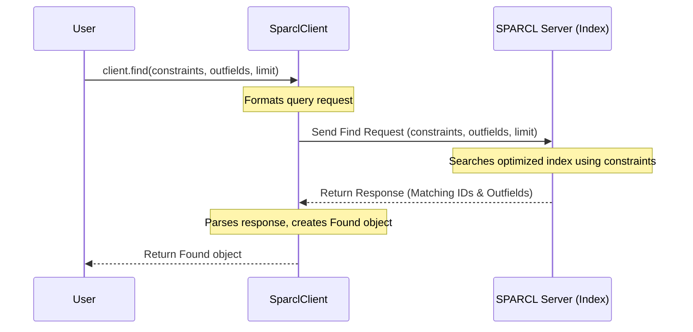

# Chapter 2: Data Discovery (`client.find`)

In [Chapter 1: SPARCL Client (`SparclClient`)](01_sparcl_client___sparclclient___.md), we learned how to create our `SparclClient` object, which is like our personal remote control or librarian for the huge SPARCL spectral library. Now that we have our `client`, how do we ask the library to find the specific spectral "books" we're interested in?

## Finding Needles in a Haystack: The Need for Discovery

Imagine you walk into a library with millions of books. You don't want to browse every single shelf! You have something specific in mind – maybe books by a certain author, in a particular genre, or published within a specific decade. You'd go to the library's catalog (online or card catalog) and search using those criteria.

SPARCL is similar. It contains millions of spectra. Maybe you only want spectra of galaxies (a specific "genre"), or only those with a redshift between 0.5 and 0.9 (a specific "characteristic"), or those located in a certain patch of the sky. You need a way to search the SPARCL "catalog" without downloading everything.

**Our Goal:** In this chapter, we'll learn how to use the `client.find()` method to search the SPARCL database and get a list of spectra that match our specific requirements. We'll focus on a simple use case: finding a few galaxy spectra with redshifts between 0.5 and 0.9 from specific surveys.

## Using the Catalog: `client.find()`

The `client.find()` method is SPARCL's search tool. It's like using the library's online catalog. You tell it what you're looking for (your search criteria or **constraints**), and it quickly searches through a special, optimized index of all the spectra.

It doesn't return the full spectra themselves (that would be like the catalog giving you the entire book!). Instead, it returns a list of identifiers (like catalog numbers, specifically the [Identifier (`sparcl_id`, `specid`)](04_identifier___sparcl_id____specid___.md)) for the spectra that match your search, along with some basic information (metadata) you might have asked for, like the coordinates (RA, Dec) or redshift.

This list of results is packaged in a special object called `Found`, which we'll look at more closely in [Chapter 3: Result Handling (`Found`, `Retrieved` objects)](03_result_handling___found____retrieved__objects__.md).

### Key Ingredients for `client.find()`

To use `client.find()`, you mainly need to provide:

1.  **`constraints`**: This tells SPARCL *what* to look for. It's a Python dictionary where keys are field names (like `spectype` or `redshift`) and values specify the desired criteria.
    *   For fields with specific categories (like `spectype`), you provide a list of allowed values (e.g., `['GALAXY']`).
    *   For fields with numerical values (like `redshift`), you often provide a list with two values representing the minimum and maximum range (e.g., `[0.5, 0.9]`).
    *   **Important:** You can only use specific "Core" fields for constraints. We'll touch on fields more in [Chapter 7: Field Selection (`include` parameter, `get_all/default_fields`)](07_field_selection___include__parameter___get_all_default_fields___.md). For now, common ones include `spectype`, `redshift`, `ra`, `dec`, `data_release`.
2.  **`outfields`** (Optional): This is a list of metadata field names you want SPARCL to return along with the identifiers for each matching spectrum. If you don't specify this, you'll just get the unique identifier (`sparcl_id`) and the data release (`_dr`). Like `constraints`, these must also be "Core" fields.
3.  **`limit`** (Optional): This sets a maximum number of matching spectra identifiers to return. This is useful to avoid getting back millions of results if your search is very broad. The default is usually 500.

### Example: Finding Galaxies

Let's try our use case: finding galaxy spectra with redshifts between 0.5 and 0.9 from the DESI-DR1, SDSS-DR16, or BOSS-DR16 surveys. We also want to get back their `sparcl_id`, `ra`, `dec`, `redshift`, `spectype`, and `data_release`. We'll limit the results to just 5 for this example.

First, we need our client (assuming it was created as in Chapter 1):
```python
# Assume client is already created from Chapter 1
# from sparcl.client import SparclClient
# client = SparclClient()
```

Now, let's define our search criteria:

```python
# Define which metadata fields we want in the output
outfields_to_get = ['sparcl_id', 'ra', 'dec', 'redshift', 'spectype', 'data_release']

# Define our search constraints
search_constraints = {'spectype': ['GALAXY'],
                      'redshift': [0.5, 0.9],
                      'data_release': ['DESI-DR1', 'SDSS-DR16', 'BOSS-DR16']}

# Set a limit on the number of results
result_limit = 5
```

With our ingredients ready, we call `client.find()`:

```python
# Perform the search using client.find()
found_results = client.find(outfields=outfields_to_get,
                            constraints=search_constraints,
                            limit=result_limit)

# Display the results object (we'll learn more about this next!)
found_results
```

Running this code tells the `client` to send our search request to the SPARCL server. The server searches its index and sends back the results.

The output you might see looks something like this (the exact IDs and values will vary):

```text
(success=True, nobj=5, missing=0, truncated=True, fields=['_dr', 'sparcl_id', 'data_release', 'ra', 'dec', 'redshift', 'spectype'])
```

This tells us:
*   `success=True`: The search worked!
*   `nobj=5`: We got 5 results back, as requested by our `limit`.
*   `missing=0`: None of the IDs we might have searched for were missing (not relevant here as we searched by criteria, not ID).
*   `truncated=True`: This means there were *more* than 5 spectra matching our criteria in the database, but the results were cut off at our limit of 5.
*   `fields`: These are the metadata fields included in the results, matching our `outfields_to_get` plus the default `_dr`.

The `found_results` object itself contains the list of matching `sparcl_id`s and the requested metadata. We'll learn how to access this information in the next chapter. For now, the key takeaway is that `client.find()` gives us a *list* of potential candidates, not the full spectral data yet. It's the catalog search, not borrowing the books.

## Under the Hood: How `client.find()` Searches

When you call `client.find()`, several things happen:

1.  **Request Formatting:** The `SparclClient` takes your `constraints`, `outfields`, and `limit` and formats them into a specific query message (often using a format like JSON) that the SPARCL server understands.
2.  **Sending the Request:** The client sends this message over the internet (using HTTPS) to the SPARCL server endpoint dedicated to finding data (e.g., `.../sparc/find`).
3.  **Server-Side Search:** The SPARCL server receives the request. It doesn't scan every single spectrum file! Instead, it uses a pre-built, highly optimized **index**. Think of this index like the index at the back of a textbook – it quickly points to where the relevant information (spectra matching your criteria) can be found. It searches this index based on your `constraints`.
4.  **Collecting Results:** The server identifies the `sparcl_id`s of the spectra that match the constraints. It also retrieves the specific `outfields` you requested for those spectra from the index or associated metadata tables.
5.  **Response Formatting:** The server packages the results (up to the `limit`) into a response message.
6.  **Receiving and Parsing:** Your `SparclClient` receives the response, checks if the search was successful, and parses the message to create the `Found` object containing the list of records (IDs and metadata).

Here’s a simplified diagram:



Looking briefly at the `sparclclient` code (in `sparcl/client.py`), the `find` method essentially constructs a dictionary representing the query parameters and passes it to a helper function (`_post`) that handles sending the request to the correct URL endpoint (`/find`) and processing the JSON response from the server. The server-side indexing and search logic is complex but designed for speed, allowing searches over millions of spectra very quickly.

```python
# Simplified conceptual view of client.find()

class SparclClient:
    # ... (other methods like __init__) ...

    def find(self, outfields=None, *, constraints={}, limit=500, sort=None, verbose=None):
        # 1. Prepare the query data payload
        query_data = {
            'constraints': constraints,
            'limit': limit
        }
        if outfields is not None:
            query_data['outfields'] = outfields
        if sort is not None:
            query_data['sort'] = sort
        
        # ... (Set verbosity based on client default or argument) ...

        # 2. Send the request to the '/find' endpoint on the server
        #    The _post method handles sending data and getting the response
        response_data = self._post('find', data=query_data, verbose=local_verbose) 
                                    
        # 3. Process the response and create a Found object
        #    (The actual creation happens within _post or similar)
        #    The Found object holds the header info and the list of records
        found_object = process_find_response(response_data) # Fictional processing step

        return found_object 
```

## What's Next?

We've successfully used `client.find()` to search the SPARCL catalog and get back a list of spectra identifiers (`sparcl_id`s) and some basic information that match our criteria. This list is contained within a `Found` object.

But how do we actually *see* the list of IDs? How do we work with this `Found` object? In the next chapter, we'll dive into [Chapter 3: Result Handling (`Found`, `Retrieved` objects)](03_result_handling___found____retrieved__objects__.md) to learn how to unpack and use the results returned by `client.find()`.

---

Generated by [AI Codebase Knowledge Builder](https://github.com/The-Pocket/Tutorial-Codebase-Knowledge)