# Chapter 3: Result Handling (`Found`, `Retrieved` objects)

In [Chapter 2: Data Discovery (`client.find`)](02_data_discovery___client_find___.md), we saw how to use `client.find()` to search the SPARCL catalog. We sent our search criteria and got back a result, which we stored in a variable called `found_results`.

```python
# From Chapter 2:
# out = ['sparcl_id', 'ra', 'dec', 'redshift', 'spectype', 'data_release', 'redshift_err']
# cons = {'spectype': ['GALAXY'],
#         'redshift': [0.5, 0.9],
#         'data_release': ['DESI-DR1', 'SDSS-DR16', 'BOSS-DR16']}
# found_I = client.find(outfields=out, constraints=cons, limit=20)
found_I # Displaying the object from Chapter 2
```

The output looked something like this:
```text
(success=True, nobj=20, missing=0, truncated=True, fields=['_dr', 'sparcl_id', 'data_release', 'ra', 'dec', 'redshift', 'spectype', 'redshift_err'])
```

This output looks helpful, but it doesn't immediately show us the list of galaxy `sparcl_id`s we found! Where is that list? And what does `success=True` actually mean?

## The Problem: Just a List Isn't Enough

Imagine you order some items online. When the package arrives, you don't just get the items dumped loosely in a box. You usually get the items *plus* an invoice or packing slip. This slip tells you:
*   What items are actually in the box.
*   If any items you ordered were out of stock or couldn't be shipped.
*   Maybe some details about the shipping itself.

This extra information is important! It helps you confirm you got what you expected and tells you if there were any issues.

SPARCL works similarly. When you ask it to `find` spectra (or later, to `retrieve` their data), it doesn't just send back a plain list of identifiers or data points. It sends back a "package" – a special Python object – that contains both the results you asked for *and* status information about how the operation went.

**Our Goal:** In this chapter, we'll learn how to "unpack" these result objects (like `Found` from `client.find()` and `Retrieved` from `client.retrieve()`) to check the status and access the actual data or identifiers inside. We'll use the `found_I` object from our Chapter 2 example.

## Meet the Result Objects: `Found` and `Retrieved`

SPARCL uses two main types of result objects:

1.  **`Found` Objects**: Returned by the [Data Discovery (`client.find`)](02_data_discovery___client_find___.md) method. These contain the results of a search – typically a list of identifiers (like `sparcl_id`) and any metadata (`outfields`) you requested for the spectra that matched your criteria.
2.  **`Retrieved` Objects**: Returned by the [Data Retrieval (`client.retrieve`, `client.retrieve_by_specid`)](05_data_retrieval___client_retrieve____client_retrieve_by_specid___.md) methods. These contain the *actual* spectral data (like flux, wavelength, errors) and associated metadata for the specific spectra you asked to retrieve.

Think of `Found` as the packing slip listing the *catalog numbers* of the books you found in the library search. Think of `Retrieved` as the actual *books* themselves, delivered to you after you requested them using their catalog numbers.

Both `Found` and `Retrieved` objects share a similar structure. They act like containers holding two key pieces of information:

*   **`info`**: A dictionary containing the "packing slip" information – status, warnings, counts, etc.
*   **`records`**: A list containing the actual results – either metadata records (for `Found`) or full spectrum records (for `Retrieved`).

Let's see how to access these using our `found_I` example from Chapter 2.

## Unpacking the Results: Accessing `info` and `records`

Remember our `found_I` object? It's an instance of the `Found` class.

```python
# Assuming found_I was created as in Chapter 2
# Example:
# found_I = client.find(outfields=out, constraints=cons, limit=20)

# What type is it?
type(found_I)
```
Output:
```text
sparcl.Results.Found
```

### Checking the "Packing Slip": The `info` Attribute

To check the status of our `find` operation, we access the `info` attribute. It holds a dictionary.

```python
# Access the info dictionary
status_info = found_I.info

# Print the info
print(status_info)
```
Output:
```text
{'status': {'success': True, 'info': ["Successfully found 20 records in dr_list={'DESI-DR1', 'SDSS-DR16', 'DESI-EDR', 'BOSS-DR16'}"], 'warnings': []}, 'header': {'success': True, 'nobj': 20, 'missing': 0, 'truncated': True, 'fields': ['_dr', 'sparcl_id', 'data_release', 'ra', 'dec', 'redshift', 'spectype', 'redshift_err']}}
```

This looks a bit complex, but let's break down the important parts within the `header` dictionary inside `info`:

*   **`success` (True/False)**: Did the query run without major errors? `True` means it worked.
*   **`nobj` (number)**: How many records are included in the `records` list? Here, it's 20, matching our `limit`.
*   **`missing` (number)**: If you searched by specific IDs (using `retrieve`), how many were not found? (Not relevant for our `find` example).
*   **`truncated` (True/False)**: Were there more matching results in the database than the `limit` you set? `True` means yes, the results were cut short. `False` means you got all the matches. In our example, `truncated=True` means there are more than 20 galaxies matching our criteria, but we only got the first 20.
*   **`fields` (list)**: What metadata fields are included in each record in the `records` list? This matches the `outfields` we requested plus the default `_dr`.

The `status` part of the `info` dictionary gives more detailed messages about success or warnings.

By checking `found_I.info['header']['success']` and `found_I.info['header']['truncated']`, we can programmatically know if our search worked and if we got all possible results.

### Getting the Goods: The `records` Attribute

Now, where are the actual results – the list of matching `sparcl_id`s and their metadata? They are in the `records` attribute.

```python
# Access the list of records
results_list = found_I.records

# How many records did we get?
print(f"Number of records found: {len(results_list)}")

# What does the first record look like?
first_record = results_list[0]
print(f"\nFirst record object: {first_record}")

# What type is a record object?
print(f"\nType of a record object: {type(first_record)}")
```
Output:
```text
Number of records found: 20

First record object: (_dr=DESI-DR1, sparcl_id=000003e8-8a05-11ef-a71d-525400f334e1, data_release=DESI-DR1, ra=60.007777, dec=-0.877601, redshift=0.782049, spectype=GALAXY, redshift_err=0.000012)

Type of a record object: <class 'sparcl.Results.Record'>
```

The `records` attribute is a Python list. Each item in the list is *another* special object, a `Record` object (specifically `sparcl.Results.Record`).

This `Record` object holds the metadata for one specific spectrum that matched our search. It acts somewhat like a dictionary, but you usually access its fields using **dot notation** (like accessing attributes of an object). The available attributes match the `fields` listed in the `info` dictionary.

```python
# Access specific fields from the first record using dot notation
first_sparcl_id = first_record.sparcl_id
first_ra = first_record.ra
first_redshift = first_record.redshift

print(f"SPARCL ID: {first_sparcl_id}")
print(f"RA: {first_ra}")
print(f"Redshift: {first_redshift}")
```
Output:
```text
SPARCL ID: 000003e8-8a05-11ef-a71d-525400f334e1
RA: 60.007777
Redshift: 0.782049
```

So, to get the `sparcl_id` of the *third* matching spectrum, you would use `found_I.records[2].sparcl_id`.

**Important Note:** For `Found` objects (from `client.find`), the `records` list contains these `Record` objects with *metadata*. For `Retrieved` objects (from `client.retrieve`), the `records` list will contain `Record` objects that also have attributes like `flux`, `wavelength`, `ivar`, etc., holding the actual spectral data arrays (often as NumPy arrays).

### A Shortcut for IDs: The `ids` Attribute

Since getting just the list of `sparcl_id`s is very common after using `client.find()`, `Found` objects provide a convenient shortcut: the `ids` attribute.

```python
# Get the list of just the sparcl_ids
sparcl_id_list = found_I.ids

# Print the first few IDs
print(sparcl_id_list[:5])
```
Output:
```text
['000003e8-8a05-11ef-a71d-525400f334e1', '00000411-8603-11ef-a5eb-525400f334e1', '00000f02-a2dc-11ee-ac91-525400ad1336', '00001191-8bdd-11ef-b09e-525400f334e1', '0000187f-8bde-11ef-9bec-525400f334e1']
```
This directly gives you a simple Python list of strings, where each string is a `sparcl_id`. This is often exactly what you need to pass to `client.retrieve()` later.

**Note:** `Retrieved` objects do *not* typically have this `ids` shortcut attribute, as their primary purpose is to deliver the full records, not just the IDs.

## Under the Hood: How Result Objects are Made

When you call `client.find()` or `client.retrieve()`, your `SparclClient` sends a request to the SPARCL server. The server processes the request and sends back a response. This response isn't just raw data; it's usually structured data (like JSON) containing both the results (data/IDs) and the status information (header/info).

1.  **Receive Response:** The `SparclClient` receives this structured response from the server.
2.  **Parse Response:** It parses the response, separating the status/header information from the list of records.
3.  **Create Result Object:** It creates an instance of the appropriate class (`Found` or `Retrieved`).
4.  **Populate Attributes:** It populates the `info` attribute with the parsed status/header data and the `records` attribute with the list of results (creating individual `Record` objects for each item in the list).
5.  **Return Object:** It returns the fully populated `Found` or `Retrieved` object to you.

Here’s a simplified view:

```mermaid
sequenceDiagram
    participant User
    participant SparclClient
    participant SPARCLServer as SPARCL Server
    participant ResultObject as Found/Retrieved Object

    SPARCLServer->>SparclClient: Send Response (Header + Records Data)
    Note over SparclClient: Receives and parses structured response
    SparclClient->>ResultObject: Create Found/Retrieved()
    SparclClient->>ResultObject: Populate .info with Header
    SparclClient->>ResultObject: Populate .records with Records Data
    ResultObject-->>SparclClient: Return populated object
    SparclClient-->>User: Return Found/Retrieved object
```



Looking inside the `sparclclient` library, particularly in the `sparcl/Results.py` file (or similar), you'd find the definitions for the `Found`, `Retrieved`, and `Record` classes. These classes define the structure (`__init__` method) and how the attributes (`info`, `records`, `ids`) are accessed.

```python
# Simplified conceptual view of Found and Retrieved classes

# Potentially in sparcl/Results.py
class Record:
    def __init__(self, data_dict):
        # Store data and maybe make accessible via attributes
        self._data = data_dict
        for key, value in data_dict.items():
            setattr(self, key, value)
    
    def __repr__(self):
        # How the record looks when printed
        items = ', '.join(f"{k}={v}" for k, v in self._data.items() if not isinstance(v, list) and not isinstance(v, np.ndarray)) # Avoid printing long arrays
        return f"({items})"

class Found:
    def __init__(self, header_info, records_data):
        # Store the header information
        self.info = {'header': header_info, 'status': {'success': header_info.get('success', False), 'warnings':[], 'info':[]}} # Simplified status
        
        # Create Record objects from the list of record dictionaries
        self.records = [Record(rec_dict) for rec_dict in records_data]
        
        # Store basic stats from header
        self.success = header_info.get('success', False)
        self.nobj = header_info.get('nobj', 0)
        self.truncated = header_info.get('truncated', False)
        
    @property
    def ids(self):
        # Convenience property to get just the sparcl_ids
        return [rec.sparcl_id for rec in self.records if hasattr(rec, 'sparcl_id')]

    def __repr__(self):
         # How the Found object looks when printed
         header = self.info.get('header', {})
         return f"(success={header.get('success')}, nobj={header.get('nobj')}, missing={header.get('missing', 0)}, truncated={header.get('truncated')}, fields={header.get('fields')})"


class Retrieved:
    def __init__(self, header_info, records_data):
        # Store the header information (might include status details)
        self.info = {'header': header_info, 'status': header_info.get('status', {})}
        
        # Create Record objects (these will have flux, wavelength etc.)
        self.records = [Record(rec_dict) for rec_dict in records_data]

        # Store basic stats
        self.success = self.info['status'].get('success', False)
        self.nobj = len(self.records) 
        # ... other attributes like missing count ...

    def reorder(self, id_list):
        # Method to reorder records (as shown in the notebook)
        # ... implementation ...
        pass
    
    def __repr__(self):
         # How the Retrieved object looks when printed
         status = self.info.get('status', {})
         n_rec = len(self.records)
         return f"(success={status.get('success')}, nobj={n_rec}, missing={status.get('missing', 0)}, warnings={len(status.get('warnings',[]))})"

```
This structure makes it easy and consistent to check if your `find` or `retrieve` call worked and then access the results you need.

## What's Next?

We now understand how SPARCL packages its results using `Found` and `Retrieved` objects. We know how to check the `info` attribute for status and access the list of `records` (or the convenient `ids` list for `Found` objects).

In our example, `client.find()` gave us a `Found` object containing `Record` objects with metadata, including the crucial `sparcl_id` for each matching galaxy. What exactly *is* this `sparcl_id`? How is it different from other identifiers like `specid`?

In the next chapter, we'll take a closer look at [Chapter 4: Identifier (`sparcl_id`, `specid`)](04_identifier___sparcl_id____specid___.md) to understand these important keys to accessing specific spectra.

---

Generated by [AI Codebase Knowledge Builder](https://github.com/The-Pocket/Tutorial-Codebase-Knowledge)