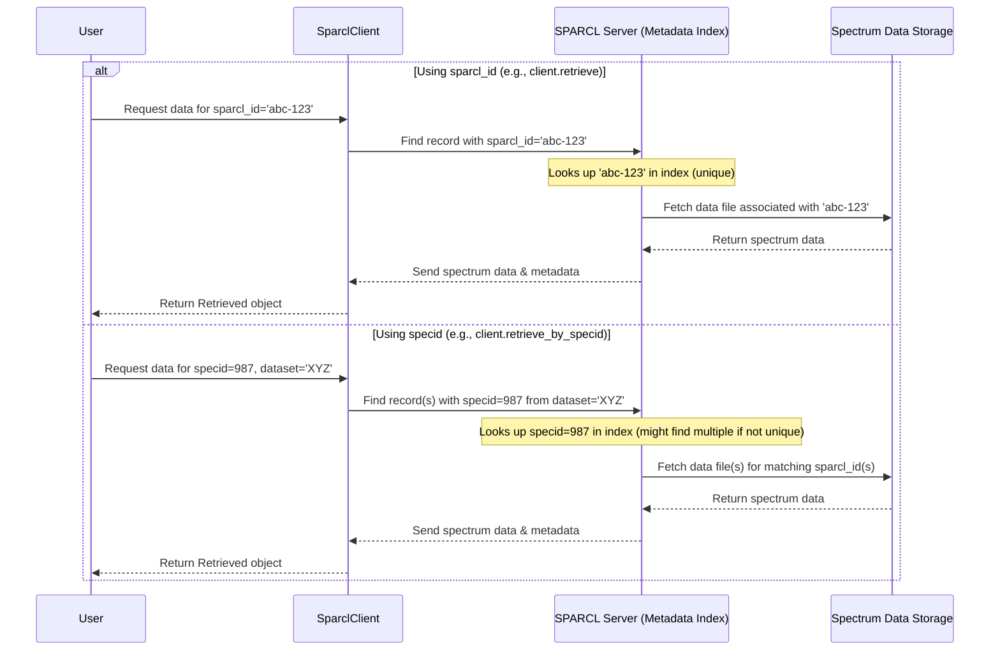

# Chapter 4: Identifier (`sparcl_id`, `specid`)

In [Chapter 3: Result Handling (`Found`, `Retrieved` objects)](03_result_handling___found____retrieved__objects__.md), we learned how to unpack the results from `client.find()`. We saw that the `found_I` object contained a list of `Record` objects, and each record had metadata like `ra`, `dec`, `redshift`, and importantly, a `sparcl_id`.

```python
# From Chapter 3, accessing the first record's sparcl_id:
# first_record = found_I.records[0]
# first_sparcl_id = first_record.sparcl_id
# print(first_sparcl_id)
# Output might be: 000003e8-8a05-11ef-a71d-525400f334e1
```

What exactly is this `sparcl_id`? And how does it relate to another identifier called `specid` that we saw listed in the metadata tables in Chapter 2?

## The Problem: Finding a Specific Spectrum Needle

Imagine SPARCL is a gigantic digital library containing millions and millions of spectra. When you find a spectrum you're interested in (maybe through `client.find()`), how do you tell SPARCL, "I want *that specific* spectrum again later," or "Give me the full data for *this exact one*"? You need a unique way to point to it.

Think about a real library. If you find a book you like, you might write down its title and author. But sometimes, different books have the same title, or there are different editions. To be absolutely sure you get the exact book, you need a unique identifier, like its ISBN (International Standard Book Number). Libraries also have their own internal numbers (call numbers) to locate books on shelves.

SPARCL has a similar system for spectra.

**Our Goal:** In this chapter, we'll understand the two main types of identifiers used in SPARCL: `sparcl_id` (like an ISBN) and `specid` (like a library call number). We'll learn why both exist and why `sparcl_id` is the key to guaranteed uniqueness.

## Meet the Identifiers: `sparcl_id` and `specid`

SPARCL uses two primary codes to pinpoint specific spectra:

1.  **`sparcl_id` (SPARCL Identifier):**
    *   **What it is:** This is a **U**niversally **U**nique **Id**entifier (UUID) assigned by SPARCL itself when a spectrum is added to the database.
    *   **Key Feature:** It is **guaranteed** to be unique across *all* datasets and *all* spectra within SPARCL. No two spectra will ever have the same `sparcl_id`.
    *   **Format:** It looks like a long string of letters and numbers separated by hyphens, like `000003e8-8a05-11ef-a71d-525400f334e1`.
    *   **Analogy:** Think of the `sparcl_id` as the **ISBN** of a book. It's a globally unique number that identifies that specific book (or spectrum) no matter which library (or dataset) it's in.

2.  **`specid` (Spectrum Identifier):**
    *   **What it is:** This is an identifier that comes from the *original astronomical survey* data release (like SDSS, DESI, BOSS). It's the ID the survey used internally.
    *   **Key Feature:** While useful, `specid` is **not guaranteed** to be unique across different surveys. For example, SDSS might have a spectrum with `specid = 12345`, and DESI might *also* have a completely different spectrum with `specid = 12345`. Sometimes, even within complex surveys, `specid` might not be unique on its own without other information (like a plate number or MJD in older SDSS data).
    *   **Format:** It's often a large integer number, like `6988698046080241664`.
    *   **Analogy:** Think of the `specid` as a library's internal **call number** or catalog ID. It helps locate the item *within that specific library system* (the original survey), but another library might use the same call number for a different book.

**Why two identifiers?**

*   **`specid`** is useful because it links back directly to the original survey data. If you are working with data directly downloaded from SDSS or DESI, you might already know the `specid`s you are interested in.
*   **`sparcl_id`** is essential because SPARCL combines data from *many* different surveys. Using only `specid` would lead to confusion and ambiguity. `sparcl_id` provides a single, reliable, unique "name tag" for every single spectrum managed by SPARCL.

## Using the Identifiers

When you use [Data Discovery (`client.find`)](02_data_discovery___client_find___.md) to search for spectra based on criteria (like redshift or spectype), the results ([Result Handling (`Found`, `Retrieved` objects)](03_result_handling___found____retrieved__objects__.md)) will always include the `sparcl_id`. You can also request the `specid` as an `outfield` if you need it.

```python
# Example from Chapter 2/3:
# out = ['sparcl_id', 'specid', 'ra', 'dec', 'redshift', 'spectype', 'data_release']
# cons = {'spectype': ['GALAXY'],
#         'redshift': [0.5, 0.9],
#         'data_release': ['DESI-DR1', 'SDSS-DR16', 'BOSS-DR16']}
# found_I = client.find(outfields=out, constraints=cons, limit=5)

# Accessing IDs from the first record
first_record = found_I.records[0]
print(f"SPARCL ID: {first_record.sparcl_id}")
print(f"Spec ID:   {first_record.specid}")
print(f"Release:   {first_record.data_release}") 
```
Output might look like:
```text
SPARCL ID: 000003e8-8a05-11ef-a71d-525400f334e1
Spec ID:   39633285986387037
Release:   DESI-DR1
```
Notice how the `sparcl_id` is the UUID format, and the `specid` is a large integer. This particular spectrum came from DESI-DR1. Another spectrum from SDSS-DR16 in the results might have a completely different `specid`, but it will also have its own unique `sparcl_id`.

When you want to retrieve the full data for specific spectra, you'll primarily use the `sparcl_id` with the `client.retrieve()` method. However, because `specid` is commonly used, SPARCL provides a convenient `client.retrieve_by_specid()` method as well. We'll cover these retrieval methods in detail in the next chapter: [Data Retrieval (`client.retrieve`, `client.retrieve_by_specid`)](05_data_retrieval___client_retrieve____client_retrieve_by_specid___.md).

## Under the Hood: Assigning and Storing IDs

How does SPARCL manage these two identifiers?

1.  **Data Ingestion:** When a new data release from a survey (like DESI-DR1) is added to SPARCL, the SPARCL system processes each spectrum file.
2.  **`sparcl_id` Assignment:** For every individual spectrum record it ingests, SPARCL generates a new, unique `sparcl_id` (a UUID). This ensures it's different from all other spectra already in SPARCL, regardless of which survey they came from.
3.  **Metadata Storage:** SPARCL stores this newly generated `sparcl_id` along with all the other metadata extracted from the spectrum file. This metadata includes the *original* `specid` from the survey, as well as things like coordinates (ra, dec), redshift, spectype, data release name, etc.
4.  **Indexing:** This metadata, including both `sparcl_id` and `specid`, is put into a searchable index. This index is what `client.find()` uses to quickly locate spectra based on your criteria.
5.  **Retrieval:** When you request a spectrum using either `sparcl_id` (via `client.retrieve()`) or `specid` (via `client.retrieve_by_specid()`), SPARCL uses its internal mapping to find the corresponding unique record(s) and fetch the full data file.

Here’s a simplified view of what happens when SPARCL looks up a spectrum using either ID:



The key point is that internally, SPARCL relies on the `sparcl_id` as the ultimate unique key. When you use `specid`, SPARCL first looks up which `sparcl_id`(s) correspond to that `specid` (possibly within a specific dataset context if provided) and then retrieves the data using the `sparcl_id`.

## What's Next?

We now understand the difference between the globally unique `sparcl_id` (like an ISBN) assigned by SPARCL and the survey-specific `specid` (like a library call number). We know why both are useful and that `sparcl_id` is the most reliable way to refer to a specific spectrum within the SPARCL ecosystem.

With this knowledge of identifiers, we're ready to actually fetch the detailed spectral data (the light fingerprints!). In the next chapter, we'll learn how to use the `sparcl_id` list we obtained from `client.find()` to download the full spectrum records using `client.retrieve()`, and also how to retrieve data directly using `specid` with `client.retrieve_by_specid()`.

Let's move on to [Chapter 5: Data Retrieval (`client.retrieve`, `client.retrieve_by_specid`)](05_data_retrieval___client_retrieve____client_retrieve_by_specid___.md)!

---

Generated by [AI Codebase Knowledge Builder](https://github.com/The-Pocket/Tutorial-Codebase-Knowledge)