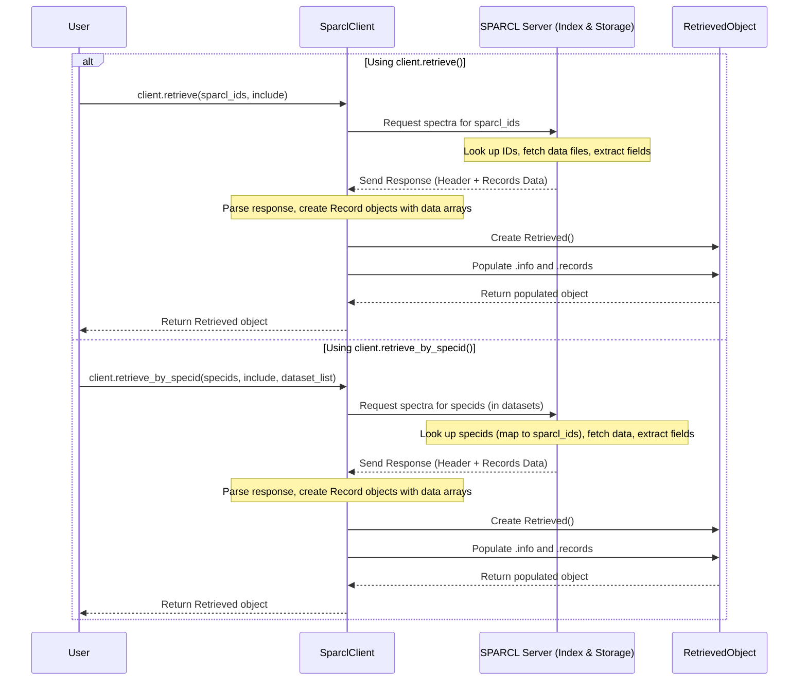

# Chapter 5: Data Retrieval (`client.retrieve`, `client.retrieve_by_specid`)

In [Chapter 4: Identifier (`sparcl_id`, `specid`)](04_identifier___sparcl_id____specid___.md), we learned about the different "name tags" SPARCL uses for spectra: the unique `sparcl_id` (like an ISBN) and the survey-specific `specid` (like a library call number). We saw how [Data Discovery (`client.find`)](02_data_discovery___client_find___.md) gives us a list of these identifiers, particularly the `sparcl_id`, for spectra that match our search criteria.

## Motivation: From ID List to Actual Data

Okay, so we searched the library catalog (`client.find`) and got a list of catalog numbers (`sparcl_id`s) for the books (spectra) we're interested in. That's great! But a list of numbers isn't the same as having the books themselves. How do we actually *get* the books from the library shelves?

In SPARCL terms, we have a list of `sparcl_id`s (or maybe `specid`s from another source). Now we need to tell SPARCL: "Please go fetch the *full data* – the flux, wavelength, errors, and metadata – for these specific spectra." This action of fetching the complete data based on known identifiers is called **Data Retrieval**.

**Our Goal:** In this chapter, we'll learn how to use the `client.retrieve()` and `client.retrieve_by_specid()` methods to download the full spectral data once we have the identifiers. We'll use the lists of `sparcl_id`s and `specid`s we obtained in the previous chapters as examples.

## Asking the Librarian for the Books: `client.retrieve()`

The `client.retrieve()` method is your primary tool for getting the full data when you have the **`sparcl_id`**s.

Think of it like this: you hand your list of ISBNs (`sparcl_id`s) to the librarian (`client`). The librarian then goes into the stacks (SPARCL's data storage), finds the exact books (spectra) corresponding to those ISBNs, and brings them back to you.

What you get back isn't just the raw data points dumped together. Similar to `client.find()`, the `client.retrieve()` method returns a special "package" – a `Retrieved` object (which we learned about in [Chapter 3: Result Handling (`Found`, `Retrieved` objects)](03_result_handling___found____retrieved__objects__.md)). This object contains:
*   Status information (`info`) about whether the retrieval was successful for each requested ID.
*   A list (`records`) of [Spectrum Record](06_spectrum_record_.md) objects, where each record holds the *complete data* (flux, wavelength, error arrays, metadata) for one successfully retrieved spectrum.

### Key Ingredients for `client.retrieve()`

1.  **`uuid_list`**: This is the most important part – a Python list containing the `sparcl_id` strings for the spectra you want to retrieve.
2.  **`include`** (Optional): This tells SPARCL *which* specific data fields you want back for each spectrum (e.g., just flux and wavelength, or maybe the model fit too?). We'll cover this in detail in [Chapter 7: Field Selection (`include` parameter, `get_all/default_fields`)](07_field_selection___include__parameter___get_all_default_fields__.md). For now, we can use a predefined list or the default. If you don't specify it, you get a standard set of useful fields ('DEFAULT').
3.  **`dataset_list`** (Optional): You can optionally provide a list of dataset names (like `['DESI-DR1', 'SDSS-DR16']`) to restrict the search for the `sparcl_id`s to only those datasets. Usually, you omit this to search across all datasets, as `sparcl_id` is unique anyway.
4.  **`limit`** (Optional): Maximum number of records to return. Defaults to 500. **Important:** The maximum allowed is currently 24,000, and requesting too many spectra at once (e.g., > 10,000) might cause the request to time out or fail. It's often better to retrieve large numbers of spectra in smaller batches.

### Example: Retrieving Galaxy Spectra using `sparcl_id`

Let's use the `sparcl_id` list we got from `client.find()` in Chapter 2/3 (stored in `found_I`). We'll retrieve the first 20 spectra from that list. We also need to specify which data fields we want using the `include` parameter. The example notebook defines a list called `inc` for this.

First, get the list of IDs from our `Found` object:
```python
# Assume found_I was created in Chapter 2/3
# found_I = client.find(outfields=out, constraints=cons, limit=20)

# Get the list of sparcl_ids using the .ids attribute (from Chapter 3)
ids_I = found_I.ids

# ids_I now holds a list like:
# ['000003e8-8a05-11ef-a71d-525400f334e1', '00000411-8603-11ef-a5eb-525400f334e1', ...]
```

Next, define the fields we want to retrieve (we'll just use the list `inc` defined in the example notebook):
```python
# Define the fields to include in the retrieve function (from example notebook)
inc = ['sparcl_id', 'specid', 'data_release', 'redshift', 'flux',
       'wavelength', 'model', 'ivar', 'mask', 'spectype', 'ra', 'dec']
```

Now, call `client.retrieve()`:
```python
# Perform the retrieval using the list of sparcl_ids and include fields
results_I = client.retrieve(uuid_list=ids_I, include=inc)

# Check the status information (see Chapter 3)
results_I.info
```
Running this code tells the `client` to send the list of `sparcl_id`s to the SPARCL server. The server finds the data files for these IDs, extracts the requested fields (`inc`), and sends them back.

The output of `results_I.info` might look like:
```text
{'status': {'success': True,
  'info': ["Successfully found 20 records in dr_list={'DESI-EDR', 'BOSS-DR16', 'SDSS-DR16', 'DESI-DR1'}"],
  'warnings': []}}
```
This tells us the retrieval was successful (`success=True`) and we got back 20 records (matching the 20 IDs we provided).

The actual data is inside `results_I.records`. Each element `results_I.records[i]` is a [Spectrum Record](06_spectrum_record_.md) object containing attributes like `.flux`, `.wavelength`, `.ivar`, `.model`, `.redshift`, etc., holding the full data for one spectrum.

```python
# Access the first retrieved record (see Chapter 3 & 6 for details)
first_retrieved_record = results_I.records[0]

# Access the flux and wavelength arrays for the first spectrum
flux_array = first_retrieved_record.flux
wavelength_array = first_retrieved_record.wavelength

# Print the type and shape of the flux array (it's usually a NumPy array)
import numpy as np # Need to import numpy to check the type
print(f"Type of flux data: {type(flux_array)}")
print(f"Shape of flux data: {flux_array.shape}")
```
Output might be:
```text
Type of flux data: <class 'numpy.ndarray'>
Shape of flux data: (7781,)
```
This shows we now have the actual spectral data (as NumPy arrays) ready for analysis!

## Using the Library Call Numbers: `client.retrieve_by_specid()`

What if you don't have the `sparcl_id`s? Perhaps you started with a list of identifiers directly from an original survey like SDSS or DESI. These are the `specid`s (like library call numbers).

SPARCL provides a convenient method, `client.retrieve_by_specid()`, for this situation. You give it a list of `specid`s, and it tries to find the corresponding spectra and return their full data.

**Important Consideration:** Remember from [Chapter 4: Identifier (`sparcl_id`, `specid`)](04_identifier___sparcl_id____specid___.md) that `specid`s are *not* guaranteed to be unique across different surveys. `specid=12345` could exist in both SDSS and DESI, referring to different spectra.

To handle this potential ambiguity, `client.retrieve_by_specid()` has an optional `dataset_list` parameter. It's **highly recommended** to provide this list if you know which survey(s) your `specid`s come from (e.g., `dataset_list=['SDSS-DR16']`) to ensure you get the correct spectra. If you don't provide it, SPARCL will search across *all* datasets, and if a `specid` exists in multiple datasets, it might return multiple records for that single `specid`.

### Key Ingredients for `client.retrieve_by_specid()`

1.  **`specid_list`**: A Python list of the `specid`s (usually integers) you want to retrieve.
2.  **`dataset_list`** (Optional, but Recommended): A list of dataset names (e.g., `['DESI-DR1']`) to search within.
3.  **`include`** (Optional): Same as for `client.retrieve()`, specifies which data fields to return. Defaults to 'DEFAULT'.
4.  **`limit`** (Optional): Maximum number of records to return. Defaults to 500. Max allowed is 24,000.

### Example: Retrieving Spectra using `specid`

Let's use the `specid`s we got from the `sparcl.main` table query in Chapter 3 (stored in the pandas DataFrame `found_II`).

First, extract the `specid`s into a Python list of integers:
```python
# Assume found_II DataFrame was created in Chapter 3
# found_II = qc.query(sql=q, fmt='pandas')

# Extract the 'specid' column and convert to a list of integers
# Note: specids from surveys are often large integers (int64)
specids = [int(s) for s in found_II.specid]

# specids now holds a list like:
# [6802933904984788992, 39633149608592885, 6767971084522508288, ...]
```

Now, define the fields to include (we can reuse the `inc` list from before):
```python
# Reuse the include list from the previous example
# inc = ['sparcl_id', 'specid', 'data_release', 'redshift', 'flux', ...]
```

Call `client.retrieve_by_specid()`:
```python
# Perform the retrieval using the list of specids
# Note: In a real case, you might add dataset_list=['DESI-DR1', 'BOSS-DR16', ...]
results_II = client.retrieve_by_specid(specid_list=specids, include=inc)

# Check the status information
results_II.info
```
The output of `results_II.info` might look like:
```text
{'status': {'success': True,
  'info': ["Successfully found 24 records in dr_list={'DESI-EDR', 'BOSS-DR16', 'SDSS-DR16', 'DESI-DR1'}"],
  'warnings': []}}
```
This indicates success. Notice it might say it found *more* records (e.g., 24) than the original list (e.g., 20 `specid`s). This could happen if some `specid`s existed in multiple data releases that were searched (because we didn't specify a `dataset_list`).

Again, the full data is in `results_II.records`, ready for exploration as described in [Chapter 3: Result Handling (`Found`, `Retrieved` objects)](03_result_handling___found____retrieved__objects__.md) and [Chapter 6: Spectrum Record](06_spectrum_record_.md).

## Under the Hood: How Retrieval Works

When you call `client.retrieve()` or `client.retrieve_by_specid()`, the process is different from `client.find()`. Instead of just searching a metadata index, SPARCL needs to access the actual, potentially large, data files.

1.  **Request Formatting:** Your `SparclClient` takes the list of identifiers (`sparcl_id` or `specid`), the `include` list, and other parameters, and formats them into a request for the SPARCL server.
2.  **Sending Request:** The client sends this request over the internet (HTTPS) to the specific SPARCL endpoint responsible for retrieving full spectra (e.g., `.../sparc/spectras`).
3.  **ID Lookup:** The SPARCL server receives the request.
    *   If using `sparcl_id`, it directly looks up these unique IDs in its master index.
    *   If using `specid`, it looks up the `specid`s (within the specified `dataset_list`, if provided) and finds the corresponding unique `sparcl_id`(s).
4.  **Data File Location:** The server uses the `sparcl_id`(s) to determine the location of the original data files (often in FITS format) in its storage system.
5.  **Data Extraction:** The server accesses these data files. It reads the necessary data arrays (like flux, wavelength, inverse variance/error) and metadata fields specified in your `include` list.
6.  **Response Packaging:** The server packages the extracted data and status information (like which IDs were found or missing) into a response message, often using an efficient format suitable for potentially large arrays.
7.  **Receiving and Parsing:** Your `SparclClient` receives the response. It checks the status and parses the message, reconstructing the data arrays (often as NumPy arrays) and metadata into individual `Record` objects.
8.  **Create Retrieved Object:** It bundles these `Record` objects along with the overall status `info` into a `Retrieved` object.
9.  **Return Object:** The `Retrieved` object is returned to you.

Here’s a simplified diagram:



Looking briefly at the `sparclclient` code (in `sparcl/client.py`), the `retrieve` and `retrieve_by_specid` methods construct a dictionary payload with the IDs and parameters. This payload is sent via the internal `_post` method to the `/spectras` endpoint on the server. The server does the heavy lifting of finding and reading the data files. The client then receives the response (often in a format like Python's `pickle` for efficiency with NumPy arrays) and uses helper functions (likely within `sparcl/Results.py`) to deserialize this data and create the `Retrieved` and `Record` objects, ensuring the data arrays are properly loaded (e.g., as NumPy `ndarray`s).

```python
# Simplified conceptual view of client.retrieve()

class SparclClient:
    # ... (other methods like __init__, find) ...

    def retrieve(self, uuid_list, *, include='DEFAULT', dataset_list=None, limit=500, verbose=None):
        # 1. Prepare the query data payload
        query_data = {
            'uuids': uuid_list,  # List of sparcl_ids
            'include': include,  # Fields to get
            'limit': limit,
            'format': 'pkl'      # Often uses efficient pickle format
        }
        if dataset_list is not None:
            query_data['datasets'] = dataset_list
            
        # ... (Set verbosity) ...

        # 2. Send the request to the '/spectras' endpoint
        #    The _post method handles sending and receiving (potentially large) data
        response_data = self._post('spectras', data=query_data, verbose=local_verbose) 
                                    
        # 3. Process the response (deserialize pickled data) and create a Retrieved object
        #    This happens within _post or a helper, creating Record objects with NumPy arrays etc.
        retrieved_object = process_retrieve_response(response_data) # Fictional processing step

        return retrieved_object

    def retrieve_by_specid(self, specid_list, *, include='DEFAULT', dataset_list=None, limit=500, verbose=False):
         # 1. Prepare the query data payload (similar, but uses 'specids')
        query_data = {
            'specids': specid_list, # List of specids
            'include': include,
            'limit': limit,
            'format': 'pkl'
        }
        if dataset_list is not None:
            query_data['datasets'] = dataset_list
        
        # ... (Set verbosity) ...
        
        # 2. Send the request to the '/spectras' endpoint
        response_data = self._post('spectras', data=query_data, verbose=local_verbose)
        
        # 3. Process response and create Retrieved object
        retrieved_object = process_retrieve_response(response_data) # Fictional processing step
        
        return retrieved_object
```

## What's Next?

Congratulations! You've successfully retrieved the full spectral data using both `client.retrieve()` (with `sparcl_id`s) and `client.retrieve_by_specid()` (with `specid`s). You received a `Retrieved` object containing the complete information for the requested spectra.

This `Retrieved` object holds a list of `records`. What exactly is inside one of these `Record` objects when you retrieve data? What fields like `flux`, `wavelength`, `ivar`, `model`, and metadata does it contain, and what do they mean?

In the next chapter, we'll take a close look at the structure and contents of a single [Chapter 6: Spectrum Record](06_spectrum_record_.md).

---

Generated by [AI Codebase Knowledge Builder](https://github.com/The-Pocket/Tutorial-Codebase-Knowledge)