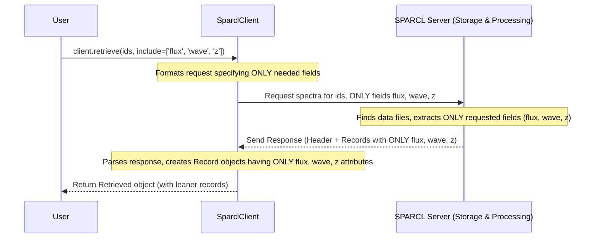

# Chapter 7: Field Selection (`include` parameter, `get_all/default_fields`)

In [Chapter 6: Spectrum Record](06_spectrum_record_.md), we looked inside a single `Spectrum Record` object returned by `client.retrieve()`. We saw it contained various pieces of information, like the scientific measurements (`flux`, `wavelength`, `ivar`, `mask`, `model`) and descriptive details or metadata (`sparcl_id`, `specid`, `redshift`, `ra`, `dec`, `spectype`, `data_release`).

But what if you don't *need* all that information? Maybe for your specific task, you only need the basic spectrum data (flux and wavelength) and the redshift. Getting everything else (like the model fit, the mask, coordinates, etc.) means transferring more data than necessary, which could be slower, especially if you're retrieving many spectra.

## Motivation: Ordering Only What You Need

Imagine ordering food at a restaurant. Sometimes you want a specific dish, like just the pasta with sauce. You don't necessarily want the full multi-course meal with appetizers, side dishes, and dessert every time. Ordering just what you need is often faster and less wasteful.

Retrieving data from SPARCL is similar. When you use [Data Retrieval (`client.retrieve`, `client.retrieve_by_specid`)](05_data_retrieval___client_retrieve____client_retrieve_by_specid___.md), you might not need every single piece of information SPARCL stores for a spectrum. Maybe you just want to plot the spectrum against its wavelength and label it with its redshift. In this case, you only need the `flux`, `wavelength`, and `redshift` fields (and perhaps `sparcl_id` to keep track of which spectrum is which).

Requesting only these specific fields (or "pieces of information") makes the data transfer smaller and potentially faster, especially if you're fetching thousands of spectra. It's like telling the librarian you only want the book's text and publication date, not the cover art or index.

**Our Goal:** In this chapter, we'll learn how to tell SPARCL exactly which fields we want when retrieving spectra using the `include` parameter. We'll also see how to find out which fields are commonly used (`get_default_fields`) or which ones are available in total (`get_all_fields`).

## Specifying Your Order: The `include` Parameter

The main tool for selecting fields during data retrieval is the `include` parameter, available in both `client.retrieve()` and `client.retrieve_by_specid()`.

Instead of getting the default set of fields (or potentially *all* fields), you can give `include` a Python list of strings, where each string is the exact name of a field you want.

### Example: Getting Just Flux, Wavelength, and Redshift

Let's revisit the retrieval from Chapter 5. Suppose we have our list of `sparcl_id`s (`ids_I`) but we only want the `sparcl_id`, `flux`, `wavelength`, and `redshift` for each spectrum.

First, we create a list containing only the names of the fields we desire:

```python
# Define the specific fields we want to retrieve
fields_we_want = ['sparcl_id', 'flux', 'wavelength', 'redshift']

# Assume ids_I contains the list of sparcl_ids from Chapter 5
# ids_I = found_I.ids 
```

Now, we call `client.retrieve()` like before, but we pass our list to the `include` parameter:

```python
# Perform the retrieval, specifying only the fields we want
results_lean = client.retrieve(uuid_list=ids_I, include=fields_we_want)

# Check the first retrieved record
first_lean_record = results_lean.records[0]
print(first_lean_record) 
```

The output might look like this (arrays shortened):
```text
(sparcl_id=000003e8-8a05-11ef-a71d-525400f334e1, redshift=0.782049, flux=array([-0.338...,  5.72 ,  5.72 ], shape=(7781,)), wavelength=array([3600. ..., 9823.2, 9824. ], shape=(7781,)))
```

Compare this to the record we printed in Chapter 6! Notice that this `first_lean_record` object *only* has the attributes we asked for: `sparcl_id`, `redshift`, `flux`, and `wavelength`. Fields like `ivar`, `mask`, `model`, `ra`, `dec`, `spectype`, `data_release` are *not* included because we didn't list them in `fields_we_want`.

This confirms that using `include` lets us control exactly what information comes back in each `Spectrum Record`.

## Discovering What's on the Menu: `get_default_fields` and `get_all_fields`

Okay, using `include` with a list of field names works great if you know the exact names. But how do you find out what fields are available? Or what fields are considered "standard"?

`sparclclient` provides two helpful methods for this:

1.  **`client.get_default_fields()`**: This method tells you the list of field names that SPARCL considers the "default" set to return. These are generally the most commonly useful fields that are available across most datasets in SPARCL.
    *   Think of this as asking the restaurant for their "standard" meal combo or the librarian for the "typical" information about a book (like title, author, ISBN).
    *   If you call `client.retrieve()` *without* specifying the `include` parameter, or if you explicitly use `include='DEFAULT'`, this is the set of fields you'll get.

2.  **`client.get_all_fields()`**: This method returns a list of *all* possible field names that are potentially available across the datasets in SPARCL. This list can be quite long and might include fields specific to certain surveys or data processing steps.
    *   Think of this as asking for the restaurant's entire menu, including every possible side dish and variation, or asking the librarian for every single recorded detail about a book (like the type of paper used, the font size, etc.).
    *   You can retrieve all these fields by using `include='ALL'` in your `retrieve` call.

### Example: Finding Default and All Fields

Let's see what these methods return:

```python
# Get the list of default field names
default_fields = client.get_default_fields()
print("Default Fields:")
print(sorted(default_fields)) # Sorting makes it easier to read

# Get the list of all possible field names
all_fields = client.get_all_fields()
print("\nAll Possible Fields (a selection):")
print(sorted(all_fields)[:15]) # Print only the first 15 sorted names for brevity
print("...")
print(f"(Total: {len(all_fields)} fields)")
```

The output might look like:
```text
Default Fields:
['dec', 'flux', 'ra', 'sparcl_id', 'specid', 'wavelength']

All Possible Fields (a selection):
['ancillary_target1', 'ancillary_target2', 'anyandmask', 'anyormask', 'bluefiber', 'boss_specobj_id', 'boss_target1', 'boss_target2', 'bgs_target', 'calibflux', 'calibflux_ivar', 'chi2', 'chi68p', 'chunk', 'class_noqso']
...
(Total: 132 fields)
```
*   The `get_default_fields()` output shows a concise list of common fields like coordinates (`ra`, `dec`), the spectrum itself (`flux`, `wavelength`), and identifiers (`sparcl_id`, `specid`). This matches what you typically get back if you don't specify `include`.
*   The `get_all_fields()` output is much longer (we only printed a sample). It includes many more specific metadata fields that might originate from particular surveys (like `boss_target1`, `desi_target`, `healpix`) or processing steps (`model`, `ivar`, `mask`, `redshift_err`).

### Discovering Fields for Specific Datasets

Sometimes, different astronomical surveys record slightly different sets of information. For example, DESI might have a specific targeting flag that SDSS doesn't, or vice-versa.

You can use `get_default_fields()` and `get_all_fields()` to see which fields are common to a *specific* list of datasets by passing the `dataset_list` argument.

```python
# Get all fields common to just SDSS-DR16 and BOSS-DR16
sdss_boss_fields = client.get_all_fields(dataset_list=['SDSS-DR16', 'BOSS-DR16'])
print(f"Fields common to SDSS-DR16 & BOSS-DR16: {len(sdss_boss_fields)} fields")

# Get all fields common to just DESI-DR1
desi_fields = client.get_all_fields(dataset_list=['DESI-DR1'])
print(f"Fields common to DESI-DR1: {len(desi_fields)} fields")

# Find fields unique to DESI-DR1 compared to the SDSS/BOSS list
desi_only_fields = set(desi_fields) - set(sdss_boss_fields)
print(f"\nSome fields potentially unique to DESI-DR1 in this comparison:")
print(list(desi_only_fields)[:10]) # Print first 10 unique fields
```

This shows that by specifying `dataset_list`, you can explore the exact metadata available for specific surveys you might be interested in. This can help you decide which fields to include in your retrieval requests.

## Under the Hood: How Field Selection Works

When you use the `include` parameter in a `client.retrieve()` or `client.retrieve_by_specid()` call, how does SPARCL ensure you only get the fields you asked for?

1.  **Request Formatting:** Your `SparclClient` takes your list of IDs, the `include` list (e.g., `['sparcl_id', 'flux', 'wavelength', 'redshift']`), and other parameters. It formats this into a specific request message for the SPARCL server. The `include` list is explicitly part of this message.
2.  **Sending Request:** The client sends this message to the SPARCL server's `/spectras` endpoint.
3.  **Server Processing:** The SPARCL server receives the request. It identifies the data files corresponding to the requested IDs.
4.  **Targeted Data Extraction:** This is the key step. Instead of reading the *entire* data file for each spectrum, the server uses the `include` list you provided. It reads *only* the specified data columns or arrays (flux, wavelength, redshift) and metadata fields (`sparcl_id`) from the files. It skips reading the data for fields you didn't ask for (like `ivar`, `model`, `ra`, `dec`).
5.  **Response Packaging:** The server packages only the extracted, requested data into the response message. Because it didn't include the extra fields, this response package is smaller than if you had requested everything.
6.  **Receiving and Parsing:** Your `SparclClient` receives this leaner response. It parses the message and creates the `Record` objects. Since the response only contained the requested fields, the resulting `Record` objects only have attributes for those fields (`sparcl_id`, `flux`, `wavelength`, `redshift`).
7.  **Return Object:** The `Retrieved` object containing these leaner `Record` objects is returned to you.

Here’s a simplified view:



Looking at the `sparclclient` code (in `sparcl/client.py`), the `retrieve` and `retrieve_by_specid` methods simply include the value passed to the `include` parameter (whether it's 'DEFAULT', 'ALL', or your custom list) in the data payload sent to the `/spectras` server endpoint.

```python
# Simplified conceptual view within client.retrieve()

class SparclClient:
    # ... other methods ...

    def retrieve(self, uuid_list, *, include='DEFAULT', dataset_list=None, limit=500, verbose=None):
        # 1. Prepare the query data payload
        query_data = {
            'uuids': uuid_list,
            'include': include,  # Pass the include parameter value directly
            'limit': limit,
            'format': 'pkl' 
        }
        # ... add datasets if specified ...
        # ... set verbosity ...

        # 2. Send the request to the '/spectras' endpoint
        #    The server uses the 'include' value in query_data 
        #    to decide which fields to read and return.
        response_data = self._post('spectras', data=query_data, verbose=local_verbose) 
                                    
        # 3. Process the response and create a Retrieved object
        #    The Record objects created will only have attributes corresponding
        #    to the fields returned by the server based on 'include'.
        retrieved_object = process_retrieve_response(response_data) 

        return retrieved_object
```

The real efficiency gain happens on the **server side**. By knowing which fields you need via the `include` parameter, the server can avoid reading and sending unnecessary data, saving time and network bandwidth.

## Conclusion

In this chapter, we learned how to be more specific when retrieving spectral data using the `include` parameter in `client.retrieve()` and `client.retrieve_by_specid()`. By providing a list of desired field names, we can get back `Spectrum Record` objects that contain only the information we need, making the process more efficient.

We also saw how the `client.get_default_fields()` and `client.get_all_fields()` helper methods allow us to discover the standard set of fields or the complete list of available fields, optionally filtering by specific datasets.

This concludes the core chapters of the `SPARCL_tutorial`! You've learned how to:
*   Connect to SPARCL using `SparclClient` ([Chapter 1: SPARCL Client (`SparclClient`)](01_sparcl_client___sparclclient___.md))
*   Search for spectra using criteria with `client.find` ([Chapter 2: Data Discovery (`client.find`)](02_data_discovery___client_find___.md))
*   Understand and handle the `Found` and `Retrieved` result objects ([Chapter 3: Result Handling (`Found`, `Retrieved` objects)](03_result_handling___found____retrieved__objects__.md))
*   Distinguish between `sparcl_id` and `specid` identifiers ([Chapter 4: Identifier (`sparcl_id`, `specid`)](04_identifier___sparcl_id____specid___.md))
*   Retrieve full spectral data using IDs with `client.retrieve` and `client.retrieve_by_specid` ([Chapter 5: Data Retrieval (`client.retrieve`, `client.retrieve_by_specid`)](05_data_retrieval___client_retrieve____client_retrieve_by_specid___.md))
*   Access the data within a `Spectrum Record` ([Chapter 6: Spectrum Record](06_spectrum_record_.md))
*   Select specific fields for retrieval using `include` ([Chapter 7: Field Selection (`include` parameter, `get_all/default_fields`)](07_field_selection___include__parameter___get_all_default_fields___.md))

With these tools, you're well-equipped to explore the vast spectral library offered by SPARCL! Feel free to revisit chapters or explore the other example notebooks and official documentation for more advanced features. Happy exploring!

---

Generated by [AI Codebase Knowledge Builder](https://github.com/The-Pocket/Tutorial-Codebase-Knowledge)