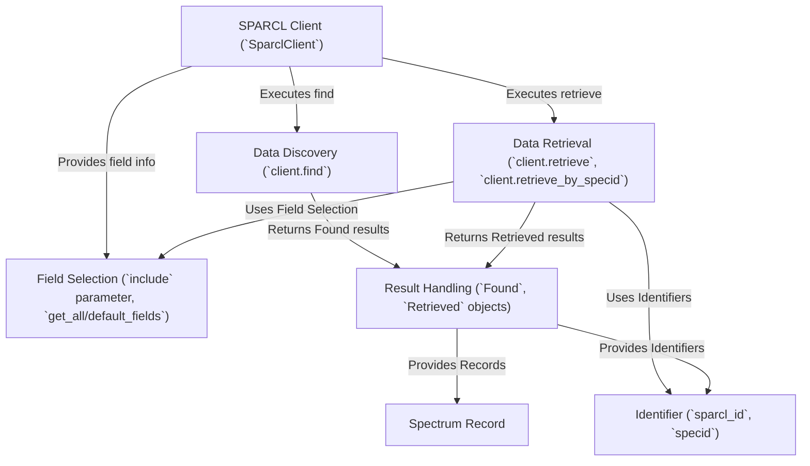

# Tutorial: SPARCL_tutorial

The `SPARCL_tutorial` project demonstrates how to use the **SPARCL Client** (*`sparclclient`*) library to interact with the *SPARCL* online service at NOIRLab.
It shows beginners how to **discover** astronomical spectra using search criteria (like position or redshift) via `client.find()`.
It then explains how to **retrieve** the complete *Spectrum Records* (containing data like flux and wavelength) using unique **Identifiers** (`sparcl_id` or `specid`) with methods like `client.retrieve()`.

**Source Repository:** [Jupyter Notebook](https://github.com/astro-datalab/notebooks-latest/blob/master/04_HowTos/SPARCL/How_to_use_SPARCL.ipynb)

## Chapters

1. [SPARCL Client (`SparclClient`)
](01_sparcl_client___sparclclient___.md)
2. [Data Discovery (`client.find`)
](02_data_discovery___client_find___.md)
3. [Result Handling (`Found`, `Retrieved` objects)
](03_result_handling___found____retrieved__objects__.md)
4. [Identifier (`sparcl_id`, `specid`)
](04_identifier___sparcl_id____specid___.md)
5. [Data Retrieval (`client.retrieve`, `client.retrieve_by_specid`)
](05_data_retrieval___client_retrieve____client_retrieve_by_specid___.md)
6. [Spectrum Record
](06_spectrum_record_.md)
7. [Field Selection (`include` parameter, `get_all/default_fields`)
](07_field_selection___include__parameter___get_all_default_fields___.md)

---

Generated by [AI Codebase Knowledge Builder](https://github.com/The-Pocket/Tutorial-Codebase-Knowledge)
